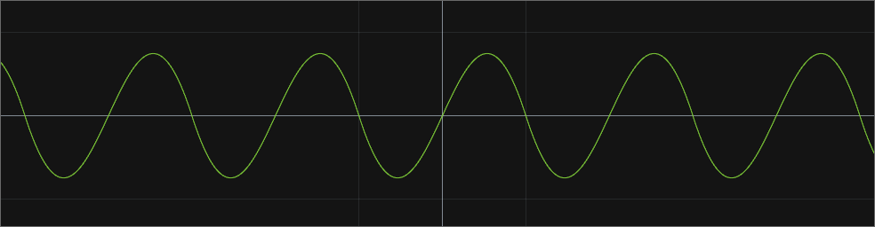

# Technological Bass
A bit of music generated from 244 characters of code, [listen here.](https://bytebeat.demozoo.org/#t=0&e=0&s=44100&bb=5d00000100f40000000000000000398f4a83103f72f8f843a72c6bd9c084494863436cf707856dc75dadf8d3fc4407884235cf7b3d7f973f87534cf0f9341e89e4a5663ebb4e5e7421294f43c8adc23399a92a983078bc2ca0d3b18141668e7a0acf5b83d10c70c5f094548bd0a6c2b872ae6e984315b30fe829b7db406e81bafe1baa9100777f73f0194582fd4a5d5228ca8ddaed34e8b77621b071ac458207a5d876d588bdcd521777d10b335212cacb29e63bb2ddcff7e7690d705bb41a5b030505996338d7a6cc86de249c8d9be26f4d63c8b6ffab221000) 
Made for [Love Byte](https://lovebyte.party/) 2023. The "music" is very basic, most of the character budget was spent on sound design.
   
### Annotated source
[Open in bytebeat player](https://bytebeat.demozoo.org/#t=0&e=0&s=44100&bb=5d00000100c70500000000000000398f4a83103f72f8f7f68dbb18af2c6497131378d528fdae67cb29f168960950b6e70e4abc0dddb121b62538402f7cf06e053d2f81db10e86de9017aebcb2f6eeabb6b2683e9f9fa0741d1ddaa45226eeacdc667f855faf953b9a231f425810ede648e33cdfc8ed7d347ae94f6a4e9430d0e110bf1ce06acaaaaac2f1084eeb776aa35f142a9ddc19967e9aaa92af3db5bb34e8d645e1362079cda430940dc6fd7ac9b3c85ac7e2818e9423361ebab7b2098add2d6939c700369438e5ec59c5ba1ed86e16b83f6e0a25eb5b803d4aff4f723773df9763da7ec28675a6786b47762b06e11086044254297b6d08dbbb7da70b972a0d6c58f6f790d10d17b2bb1bf61b764cf6cb7d572e161d54f3849fb019e0575ddc41bccc1a73f866682d17bfcdf23fbf8951d79129035e395ae8658af7fea64e02d7f3e44b6b2e9b10da465ef36f72a618dbeecf6d4f37c5964e1f0ce160f1b390c705f0e1ee024969cc929f5dc5d28f155f8b6a1c0bdb3cde8bc2de0dd1146b7c90f46d4884ddf037ba7960fc50948ddf8d8bd95c8b7bb0cfaabf87d7327e661db2e240517adf61f50a25398bf3cc081aa03d255cf857123d3c6533ea02fa270be90c547782891782184d9a3c0f1dad9d10f88feb6468a71569e59ec171bf5266727c80beca09d5ccc97a4aae0aa46c8416860667d985620b025d13580b8004b272ec46e5f94c3165b042f82fae55a50cf0df9ea15782a45da550daa20ca17555ec6458f52a6d40a7c4ad70b131bd158257846e98850f89c7ee43f76b2210ef43ead1dee82315198d0e72b160005b41ad5fd41bd1620e03cf78a8681c28058c8e9cbb22b9fbd7ab4d4f2c940111e7df4e07410b52fea6336307afa078be6d016307f4f69879a5fb0990dce2ff076d0da6d8f8036547d2146c229634944d68e0519a643d469d691bdca31dbce2ac75d3fb3d23125dc090748c12ecdb88d477adf688f4a63425f8aba6c8092fb4304ce6a97811502ffc5f66b00) 

```
s=t/4e4,                   // s = time in seconds, almost...
s+=(1-exp(-s))*38,         // warp time for crazy intro
t=s*6.4,                   // t = song position/time, in 16th
x=108*s*(               

                           // --- calculate synth frequency ---
    s<50?t*0.97:           // use crazy frequency for crazy intro
    1+((t|0)%3)/2          // arpeggio loop using *[1, 1.5, 2]
      *!!(t/4&16))         // enable/disable arpeggio every 4 bars
      *((t&63)>47?1.19:1)  // play every 4th bar ~3 semitones higher,
                           // also helps last siren sweep of the intro 
       
  %2-1,                    // convert to range -1 to 1 (sawtooth)
	
f=1-pow(t%1,               // f = normalized filter envelope 
       -sin(t/8)           // filter oscillator
       *1.8+2), 
                           // "SYNTH" - transform saw to filtered saw:

x=-(.44*(f-2)*(f+.7)*x*(x*x-1))/((f-.25)*x*x-f/2-.25),

b=t/4%1,                   // b = normalized time for kick

                           // To combine kick and synth, use linear
                           // interpolation instead of add, then use
                           // mix amount to create a side-chain feel
                           //
                           // out = mix(synth, kick, clamp01(1-2*b))
(  x+(
     sin(b**.53*214)       // kick
   -x)*
   
   min(max(1-2*b,0),1)     // mix amount (kick=0, synth=1)

   +1)*127                 // scale from -1 to 1 to byte range
   
```




### Approximated filtered sawtooth

The minimal form of the curve I used would be something like:

    (x*x*x-x)/(f*x*x-1)

I tried to improve the loudness and also the second derivative so 
filtered is more sin-like. By not maximizing the curve we get free 
volume envelope!  (I made a [shorter and even louder](https://madtealab.com/?V=1&C=1&F=3&G=1&E=0&R=0&GH=333&GS=1.6&GSY=0.4&a=0.5&aA=1&aS=4.47&aN=f&f1=%28x%2Ax%2Ax-x%29%2F%28f%2Ax%2Ax-1%29&f2=-%28.44%2A%28f-2%29%2A%28f%2B.7%29%2Ax%2A%28x%2Ax-1%29%29%2F%28%28f-.25%29%2Ax%2Ax-f%2F2-.25%29&f3=-%28x%2Ax%2Ax-x%29%2F%28f%2Ax%2Ax-1%29%2A7.6%2F%28log%281.01-f%29-3%29) version that turned out to sound more boring, so I reverted to the more awkward equation you see in the source)

### Prototyping

Long ago, I created a tool called [Mad Tea Lab](https://madtealab.com/?V=1&C=3&F=3&G=1&R=0&GX=0.68&GS=3.76&GSY=0.2&a=0.1&aMa=0.5&aN=Decay&b=0.2&bN=Noise&c=440&cMi=50&cMa=1000&cN=Freq&f1=exp%28-x%2FDecay%29&fe1=0&f1N=Dec&f2=Dec%28x%29+%2A+sin%28x%2Api%2A2%2AFreq%29+%2A+%281+-+Noise%29&f3=Dec%28x%29+%2A+rnd0%28x%29+%2A+0.1+%2A+Noise&S=3&SLE=0.7&SPM=1&Expr=%2F%2F+Drag+sliders+to+play+sound%21%0A%0A%2F%2F+You+can+always+play+the+activated+functions+as+sound%0A%2F%2F+using+the+play+button+on+the+top+of+the+functions+panel.%0A) which I use to prototype DSP and algorithms. For instance, you can set it up to [tweak a simple kick](https://madtealab.com/?V=1&C=4&F=1&G=1&E=0&R=0&GH=283&GX=0.62&GY=-0.11&GS=3.03&GSY=0.15&a=0.52&b=300&bMa=1000&c=0.32&d=-0.47&dMi=-1&f1=sin%28x%2A%2Aa%2Ab%29+%2A+clamp%28%281-%28x-d%29%29%2Fc%29&S=3&SLE=0.5) 


# Love Byte
I had great fun participating in Love Beat 2023, thanks especially to the organizing team, psenough, jeenio, gasman and the Byte Battle participants! Also some learned some interesting stuff like using [Five-limit tuning](https://en.wikipedia.org/wiki/Five-limit_tuning) in the [Seminar by pestis](https://www.youtube.com/watch?v=9eGESjbpz1A)!

This was my first real size coding attempt. I have always loved to find minimal ways to express logic, but I also dislike obfuscation. This made me more tolerant I guess, but not sure if that is a good thing? :)


# More Byte Beat Stuff!

#### Step by step Intro
* [Steady On Tim, It's Only A Budget Game (Gasman)](http://www.sizecoding.org/wiki/Steady_On_Tim)

#### Annotated
* [Earl Grey Groove (Savestate)](https://bytebeat.demozoo.org/#t=0&e=0&s=8000&bb=5d000001006a100000000000000017e07c8a61375292af28405f1f4e1c517f4d6b10aa626b92cde13f0075c7ad6fe35ecdf57b2b9bd49b062ccd26eeca731372f71e30aee3f6da9c2f3f77d08ebc8b75bc70ef9fa0282f5f38f0618e8be31beb47992c056be1e51485e8f84e845f13fd8cec556fe2f6f55c9cd3bb921cc879ef160bec1e6c99b0bee18d9e0aa5b4c696d499efe0d78b8d6a943a2aa73a1a216fbf3f088c076112e3f1d0f6b894a3ab822386faa305d51ec1baf498f2a39b8295b214ded89f57dfb8d383e485239a4abc7d5bb10488ab1d8d9fbc2b976b9448c6db49e57beebcff8d987c455387c04a22e561877416ed69f6b3f268a1f4fac85c4e07b7e17f0e5c1e0c86a809b05a4fd77c329ebe5095282fff4f73fb303ecd535c34773e64a29c0bc3ec1f0e77d3792814eb3a6898473d1a9a2b6239473ceceb52c2045d914dac0c4bfb1add4456eaceb46fbadb63e8fe79433fcbe8bdd2b5d129414a03966bc0ab9f3ad69d55e202a5ba593c1ed05927359ae560b98b1b8b44e0084203eb1aeb05aa9a9e64e08976125afcc02401304f4909da1fb9f69a684e2f085d040dc1852a312d114bfb4b322f31bb3a12d89ea67220450929944a91aae7993b651f586f14efbbf4ec7809f0213d241d1d4f40e1d0072ccbd6d79c8530b67325880a72e055222bafdd4fb5b2ce6f2c87c4c90dd34ac7627526db1e1065d8a45a2c1c17456a376f6068c60b997b0ffb525d14b174d259b7526c57eecf84bd3f72a3fdb9c645166c645adc64ff5263765f1017aead6ce52bfbf535b4bd45d84dcb35ec2720dd2b845cee03f59a70e4696313fda9e6032c4e6a39bdc5d71b8c216ff46076530853e56b35d76c16214258b8526370c7ba7136fddde351143a4e9d4f99779ceb35f999863e22e49c762ffcca92652ac3ab9dcfe015754cea8436576335d3a6ecea38eca857c4a2122ea2262ee7dd5465c604880bf2dda7beed07fdc634f2297b1984b35466189de33f99c339ac6e4a002f47e6f6f34fb3093e301b582667452bddd8151ba43d94244ac2d598e0d1209b08e7394757c1721dd12e7e245fc5bfb0d9f46576051b81d7d0ae1218e6a6675a4c102e5770b9fc146bf3f120180cf445acb8ade917323760613827294ecb6d25fab90bb02120a7b02f9eb29a5850dc3aa692667caba8f94c9a367e4d0fb6d5a85d15b932772f654cb95197df20500c93f622ed5baa18ad4150c4e64607500acbddf4aefece5e6bbbbee030a44ba690a44e85c4bcfb21e1803ccd4381db8c9fbd1b0c7fca5cf5c44647aa7c60e2de26c3006f9267809d1e10756c620cacaf43ee8987a19cd7150b747f123d3b55184150cf2df1410373d10f5980ece53e459ed2e3658b070884513f84050950dab1ab13082865ba4067a93ed0626c098c9fc17812085df6d82a179319373411da8ac5bf6396b4460a442d4537a3ba94797134067c087f2cf05fa9ffd564b92317e1206ec539735dda8476e36fe6ad26b332fde4948e83fa102249ff33595e6ece2dfe342e57c1d88f7bdf5773a13e33d02e80126685d811dfa8f1017dc7b522fade44a15d0bd71a3a9c955a1f5c0607f3fc9ec8d6be672d72e3251b862f5b14e1fb9d479670b3302ac8047dbd10199d4145512557dc4ac55dfc02238c8e10c4038730164d743ce624ffd0034b0592aa7ce4010d73cce07e40ed4b4f2c13ed80e64305ad2f70b56e48eb7a799cf49a6f1a4b0260317cd6157b7aef06535bcf8c98fa8497f616477197bcab70562f605c03d2fecd6153ae4f0c11add6dbb6d9d9365935e3ffbe506ca8abe95ac805c549679d60c10405c9f3c5642a6c6d1912053a980cfcd323ae90602f40ebef6a2707b215a1e71b9895f32fdb173b78c121926ab831783844732814f96e25c9d41fdade3962eaaf703ebb514e72f830f569b93e80018445b99e32c7f1e8b46ac54bb80af05ff4e202f6aae1d5c1a050b015206a010dfb95793ada724fbecabe5656f1f277ff27113ce2086b072ff34bc422f0112defb30047796251b78de11bc5ed3c8a5c14fa677fd152ada5da4b17688443ee76c8248a4bca3212f1a7fa05b8c23217848e668ad14a24a854d10946bdef9cd21bb2df5ae6cfad83ac885d7035027b505c2d10d5dcaaf422c9cdc83982f7ab9075bdb2ebdd1e4140e4362a78a427e8f4721ab52e679b2e437be6cf0ec6033ded53ff188646249d1c54ab9afbe0ad46056580216fadc3d93d531d3344232fb3abd6e559b2fdbafc7bc703ab4affaec0728da72d0051315c8f6ce51c85a8f8e62aa6804053aa5fa0239db26c71c6d40a73fa5d68f37b29ed3cf69038a5d7faeb1558bbf6c5d1c49d30472a1f013c7fb8de87f5705905c9834e68f2f3d2973d1affbd4bbe5f)
* [Antarctica (SthephanShi)](https://bytebeat.demozoo.org/#t=0&e=0&s=44100&bb=5d0000010053040000000000000017e07c826e3847c95a646bfcd60ca5190783cfb50c6ff06833a016d767464feea68a0128089e8860b742b5b14229d490a3395bcc958fce0209744f6fecd806ba55c19ea88e9bf2115d554e1b265c5581cc68e0541b0057c3b5197556da14f61c9782ec1f04a7a9a9f0de7f83ef42206ecc53bc0bc3f8ca53b66f4a24731086c46da337b45ecaac029f6e5c0cc595acef7a9de083fcc957d7c133e9bc6a3df263cb1f28b831068a9835e4225a1b0e3c7a43c890db6c5749966a6a88783e7439917919fb0a8df9c2ad90124b490624dacd484f4c9b03ef2f4e489409aba6a52d3f6bd1f28e91e1ccb244ac7462a900cca19e8a8af487dec7ff71351832f8f6854bf658121fed81ee157f14119bf646c704a834e0ddf2e07a7e7cc72ee3f3df73554ad520063d620c8f57ce81c7fc5297e4ed25c208fd68a1fd1e67a56641e85e53ee368421ade79017316821cb12e21beb1e25ab262a1e7b45a6bc529f043e1f9131c76976ba115f869f65ba8b2b5ece99474f0e7d6887a85e5c26c0cd43a0d86b6b85599441d6914ebf670af38ae32b46a53519e3d1e4b78fffd2c65e31659141e36df28ee27d195ae8ecded113f74fc00dff8c3b356e84ece0ba3ba4398f90cee8e01e5a7d3737fd5cded86d926157b1356eb9fb6af5b0b7bdcff83333f822276d0136861d35beeacc834f9eb5264b3b5181477b9a7702ac94ef4335d9a984cd682d78c76936694500391288ab872157a75b276003cae1d100af3b7bded5b5da7222edb060e1e9e43cefaad3c7f34b0866f062e3d29540d0cfc3b5801a85d4ad2ed1ca11c2b3a43d1b507510967b629f87d4acbf273627ea195372e28bb5661b835597f3df1c4158ed292d79a0afa8407dfff02e8332)
* [Etude de la synthèse additive (pestis)](https://github.com/vsariola/etude-de-la-synthese-additive)

#### Minimal
* [Sierpinski harmony (miiro)](https://bytebeat.demozoo.org/#t=0&e=0&s=8000&bb=5d000001006b000000000000000017e07ca66931086cd5409a56c6faeaaafe4bf90c4d9163d9ca078a8a74aec3381a42baa923829e82d04a74ab5b277f3d88215532e9b1f125f20b4ecc493c374f38845f4d7a0769655a948a98027ba943969eabe19c532631b6950e844f65cdcaa7a923982fd72ef0ff6a63c000l)
* [Psychedelica (SthephanShi)](https://bytebeat.demozoo.org/#t=0&e=0&s=8000&bb=5d0000010055000000000000000017e07c44952eb17178ef643cd5b96ca30f08727bbe216ec7a46d55edb79692c9c589c0f651fb036b6862f039b84165e485685d3c43910dca8ceec33e7ce71ac8a85c64c4a23f7b64731a1028d0083a23fffeef9800)
* [ONE MILLION alarm clocks (yehar)](https://bytebeat.demozoo.org/#t=0&e=0&s=8000&bb=5d0000010080000000000000000017e07c9e4e21a807e6955cd9097e9175eeb039846ac96a675b36bef33867ddfab4d1937d49fcfd840f660f34aec9af86fa6128105de8dc1d0b16f4293175177bebab82b68969de23ba82f92eba42bb876db8ed10ff0a03e01f13d9c75a9769527538fb0c103c205f257fc81729dce647e126bbe256df23d19f7d4f5dfe158240)

#### Other
* [A NΞW DIMΞNSION (burlynn n01se)](https://bytebeat.demozoo.org/#t=0&e=0&s=22050&bb=5d00000100c3030000000000000017e07c822026e38758f53527d94694015abd92686269360dc8eb712b5ca02db2d8132ca06512cc85d69ed74b1e874f502ccba052d8740402b402c93b0576f0f60059e3b67434aca901a31a83d29309897d1ab6bcdce305742a4c3a057a547a47c4c834e5c1ec5e43d31bc717c74fa5fef81097e049196ad4e0b2ee1bc535d8bb350fab852081ca71729f18b50372976638e135e724b657476be49676bcff7ceec229e550e827a4db7f640572120e331a87c0a220baed2295684e2c95111218f2aa4d1014f789cab8412f6830ee04f7872fef0fb414cdc5a9e68ffb3acafd0a5deb110546d32f3f9c2dfb81f4dc2d3dd0ca1ebdfd43d87c2f7f5fe327ee96c5c5449b2e018a2a9b8b8be628061ba90e73f830ee754fcd2c189aee013ee05108b197e76977be2c88dada21798abebfdcb8a73232490f03fb450db5dbd6bb202df84df1041e3765c7959101e72e5ddea9605daec9bafd09d2504ccbb4e1c8d9dcab515c8838bdb9375bf9c9f6280fd9576c0561d8d3584d67bb3431fd46b7f19925ab7fe3afc248e6b0571845c5b9e25da9dfb1071b4dc3ec39809ddd49b4d14cf70dc64a1f08217f5c96155b830c128b639d758de0f1f2812cdc9ac835c3356afd0b3f3bad83163fc3654bd922b17b8553dbccec4d529ffab2f7786ada63073074afc05957d1c472c633aeecbb81aa7ac9ea0b9b9ab1db3ed960b52e5799773e19ffbc9e4b1ac11bb42c7c97d7f94f101a8ac81ec605216f19d8faccefb856b9412bc38848b9ca3e82a55b412f09ca19f578c5f25c3eb4907971b6c6c4181c1044becee0297503e8226d8cea26926ba51992a70a89dfa9fffbf91532)
* [bytebeat? how about bitbeat? (funute)](https://bytebeat.demozoo.org/#t=0&e=0&s=44100&bb=5d00000100d1040000000000000017e07cc47939670035440ff7faa417addba35117d21dc773fd5f0c62fffe9999a3e4a52b783bdefedcfed9d31bfb279b481d514b69a25c0cecaa53fc3ca30e158fbd565277b7aca495c3a1ccd3ed710ebdc3b4fe52564565824450802bb438544870d85a60f75f86f2fb22f91902d31a1a38a44c6d31ea5b694d5afe263d12c75927e085b3562789a4be501e35de3233a8b4da4f5e5c2785a873b32d98dda3a8809f1144a376bcbbc68864047f216c2e15cc392736d915ec6ba8da7657fa7e68d1febe4ec22b5a1a18f0c2075b0f2a0f1753d95b32ae4573e81615f4e65b14035da41b9c557b7b2e88599270529c310af8b5a68235734ad8bcded3b2ef9193d00eaddc1e48246c8fab4877d2efe4601b97f84479990400c73250d213882e0ffd9beabcf820d7d3cad013ff5d0169423c834a5827d88e6466643c2efbab69c31023be0ff2ac367e408203ec47d33691845d87312898a9c76961503e4a5b8c97ca2f83c4724a640c4fe60a17b6eed33cc14490ec5cc1c29d2620a16668be9e2875548db586b98cf75e765e3382a0eb82ec1eda0fff8f2ac2c775c3c1112eea3535c4743041b7f0b955d93d66a57de1cd0076a0e5529e610be605a27b8eda48d980a9367458c0423cf262dcb820dcdeeb328e7553c3cadb9c3df9e08270bb4071959acaa6a7718ba7143a91fb7926c54273b6ffdbd04c305ee8869513950c3587e0eb1be9f62d30bc2686bdf1c70ba2f445a91dcd3231bdef820aba5a61d18ee1dd5a0a00bebdbcf70b62cd9a653f824ca71ba8fa043a926992c3ed394698d7543525aa9a06d6bb1b49e76c727ce6d4d15ae2ceca59a191eff5203561999295ba48eeab8e812314dc411a033bee86eff56b540b6df23fdf47e76235fcbecdba4e3f75b48945709147477f738d5d8dd790e2aa39b889c9c74f14568d9ae7e736161070aada78c1d0095ee858d3ccebfddb3fb3)
* [arpeggiator fun](https://bytebeat.demozoo.org/#t=0&e=0&s=44100&bb=5d00000100c2010000000000000017e07cc27237494e9c5a326ea9df5e34ac56d0e7ef73480d057a604acdb953ec4f724a606853a6db9668fc4d7757700817f92eb27b72357517af2a2953a29736580c16f66d692d785e9eacc02283b9a8a6a386856b2a28635ad1d6bf623122e105d5660135a9d2b0ddf43f6a47770f321ede3f2818bf2901360dd5c2d044d634209a6598a754e2be3763a164a991d6ca6d5d60efca2d9b9cb5bdc9bc0621f9bf3ba38e3a0ac7eda3e0b1474e79ac90b022e32cce48749fdff7b8e36805569f9689a74eeec70139844150f7b92ae4528306d30f268b1ce5bb8d3018f4b429d92b684f9f11c1ae7a497838b60475e051898024e9006996856dd521b1830e46e38b368d40e2a93c07045424250876b80054dfafb8ccb390e1804176c2cd5ed298a022e91ada6be66b5ff028928026c40caa1ccad1160a61c8c6fbfe14ea98fe4f72063597dadce1d85056ac480eff981eeefc4e4e3169a5fc553036ce043c61d467b3df4b79c8ff37523a00)
* [uni Firaz (lhphr)](https://bytebeat.demozoo.org/#t=0&e=0&s=22050&bb=5d000001000f010000000000000017e07cea6e33c3f8766089c1ebf534bc5557510539d14420ec5714ce1c3c4ad0cc7af3a0906e96527bd62bab11fbf66e6e5e10c6db872448c104fe68f5d690b72d40ef5f3af1df39e53e5ac55e42a992c9339b035961aeae2e05936aa098b80663945045b609e5abc9febc5823d7b69c8928f0b8b364d74dc80a054d2011da1e8eba2b9cd820e4d1a697a4674d4f6a0fd2229cc198ac828709927087c97523e96c6c34c7a3103cdd262028dab7ff8ee064326ce4b42553dd332be49348c24cf3e6254f6862e06fc801b8599b6fbb403b6d60da3e7d27820dfff86f8580)
* [byte funk (raphaelgoulart)](https://bytebeat.demozoo.org/#t=0&e=0&s=22000&bb=5d00000100a49e0100000000000017e07ccc7236c573590b26a14f3a848ba9f4879fd2ca37aa5dc0195ace1978ebe0270cf5d4ad3f0b456731e36c12ad5b1f12084b852bdc316e9146c911388d01fa86c1225b9589438d4287b5d039da4a82569103699973c9a4e597b2113af8ecd28eeab9217cbbac844aa51c9590ec31ce8f173cc7c961164de00e77143f908dd745a378dbb6f78006cf27497412c8d06b2d12b6c72cd595fb8e3b03826c82e42ef6c0fb3ed06c5f3dbfa213dac8ccb4b6f1c859f0033b1457b7cc5bcd144cffdf8e26884a014b2b9c6038cfe0664421566e57c3c144c24d11898457b6f81386dd070544e6d52e281e24d3dc5d696650af48a3e3c67af56a99db3197a46c492e8e24018da4737a132f68fe538f197efa9cc2b6f873760f0f5d55daf508140c609f578d595f3660ea80a1b73a040721fcc5bc6a69159b813c1706a40c7a28b9058ea3174cbf005f33e1d57d4aee2bff57d5d0524e4bb9ff7004759225ad9791f472dea42915cb56fdcaa07a07fcbbd2e89277b4c0a2d3ea3c1d2f7c325b90022fa514237e1e72e5792d8102dd38c58b2007559d657fd355f4f5d79fbb4955ebf29bb718912e576a0abc8d1e5e26b05774c462f0f34d04ed6a608bd826bcedfd357489e84281d3b063f5959f6268fc47fac4f20d5f74d0602e46342f2060b84fd429a5684e86cd18ef90a5a4d48ac3519ac9e48f8271fc4d2b6462216e0372e2ee587d320a3606da6f601e3a5da1a73ba978abc9e3894034698d84f8cd5dfb1d4e09234305543fb03bf3d338e471f690c887d9a747a3a46fa58395b3371e0839d75fed8f49facecea8a91c9c690e9b8c883e7eb811fa50cffaeb67c0ee0eaa2e0df7df80d1b5bd46b129e55ddd703a2e25d3811a7e75d59e40ffab936860863ac531aae8a47b00a468c3935c3bd4f44e853c211cc2ac379408c2dfcf445a534dbb8aa097b7a1e6cb1124addf67c999e363687917012228883f9e40bf693a1f02d28ecbf4c3df094d7467686b04c3a22c52423e93ba2c9a1e589a3d464e09109f211c970f761f2f508d43d081e32fb069e58d0aa55b707ca7f599472a23f0a76c25f85b4ee41b95ca3cdaa7c77920929fbe132aaf3b00cdc1921f07021dab78577d5eb8e80c03ce30ba244402f706b46a3aba8f20f10521e11ed8d69c098b784c10ca8842e3220b8dc2106783c13b21d2160e209a679f04ba0defe76fea80d9f706e062741447cba4e4e1ca2ef721b4d2a1f00e1b4793e58e50a3d5720732e54b4516ea42f590beaaa6c233d1533b7424cf96d2cd4135f73ae00ec519e95b3c76e84f681b03c0d805d60c9a931f10639b619edb2ce7066ce9eb32787510781971cc538464db59d648d6ebbb992b69f6005e01bfa0287de3dcb3dfddf934448c5791ced10f31afccdad40da6f43a0f03231c85b10a6bffcf2dd4c10d7947c229559c480f77e2af3b39155f0a9c1d41e4f669c32806c7394633eeaa291343ddfdf0ae6ac1141c5473e0a02d368f41839e8d139da7de8a5a8bb4da5e76000b9d9154cff2bbbf246afefad51f81ad41122e256adab4359daf8ddeab96bb731430fc8436070b6044cd525d20b11e9282f2a220218c1b5f319d3841171fb357a362efaae28de01df3404086b81fb34e73b677630e29345b8563c59888f1bde2da5970e2085608aed0814aa8d57db0ea202cf815b198a2a2dcc08f7dbedb8875aa273fcef9bed93a76ba207ebea4d71d1353548fc8f2eb721702bc0108d145c0a9f2826c8427c8d79d15d4468205272d864a86efc9cb52f8f679534887118c3ffa240ede8002526a5c2fcf10a23d98e44c08d8684708b816c616c4127b82800966cacaa77f7da34e2a4b2a8f1399abc9a4ca2fdb9c53ac34bf69ea799f93780206ec17af3c96801344d9982b78d2b49b244cd37a03dc106b568f478c08f75662562ae6f929c09f72033cd2c26456e91ca9cfca1c615fa880db4a22ae703fbc6bca068900dbf6a148f3ab02ee7e78c8b6073770f11bfa984c73483f08ec79097e19cd9eb94bb3fae13d9703385104c344a9756b9e74b3897bd4bfbe686cd69b86223b496823dcf0b840bafbeddfaf49ac81c45f89045071f5f9e6a9183cbb437c7e478d201aeca9f8cce6d6d7f7f3dbb3d929042cebd9c14f58b90e13813f7e860ab8ba81ba5f39ff5e0f1dd366dc3631533211c48b65ec5348399da8eebe2520373ac4065dd1a836ba5475061dbf9f5545c25e9f150148cf56fcea07be6b2139eabed54a28a1f0a452dbe636993de41013433f21114263c6ab208dd664c0033786d6ad2fba03cf469f63d1803711dae199218a87b97f67551cb401f652a1bddf634291a86c3082e389861d6066f2d50c2038132352772f4f8d206ddc3287237d9f74e0d59078ab48a4a35a361aea78c44dd61b55b24a1a3e302f51ab82338c5db33e76d028913c8f41ba686c652560e7339a117417df1909a227f2144ca6d45e2c4f8987732d0f6fea4882e89fb9c6e4ae11d5f160637b1690c170538075e9aeaffa8546dfcd865b3314a52ac8440f48a5868ece1c55b06c02ceb97f04ec968399be38cea3cab43c65d833251fc6a74be253e0d641ba382a8849263107e05eeefd833b8e8c5b6ba9a014dab01b2d4ad6c8befeb614df8dc6b6f8da2b762cd2373e8c63389fd72f2e1923f52f98d123560aea1b1a98830fa38e5dc3583e96b5cf3546cb249063f7881c1f380f358b1080d13527c42236c5c9659f5a5cb74ec4ec38663a30400278cd61d53f8237d993da79af84ab9dd9c7547f4203504ba0ec350e5ae2de95df4c0730badb5e433386ffd1daa047381ac595ef213f57019d948249f641c62862c499478db1a3dceba0c62faf3caa513768e5649056f50747123d13ec89814d53040176f1faea814e01b304f5d259f73b0fd767ef04ac2c4f3a28b8256079796d5febc2bae8975251602f903609230a00b7d66984298d19d34a5d59a39ea0e6ba8822c03374abbf8a57553c4caf33d516c6ca6125af807a37f877acfa11bdf2b9b1dee8c4d43ccd10274759f86268e6b56314ca7bc4c5ebadb56416d1b505e0e6d5ec985df41c98f787e19d20e6909a139a463c0de3173f1dae7c806019952f9e76ad9c35e791dac08f076666ac329b94bc739cae7c388abeefff72eaa04df4ee7cd904fcdf32eaf2666edc973c21c13e640a8129346edd0acf2deaff1680123d2eaae0e8c5054b4381e257174a564a36136ffc8b69acc7cb32762bd166036c4530f854782d00b811b407f495ad76469afa681a8fff437bb9e1d46d66b43dad2f410d02e06ea3cae1147d2679cc8e0fe1db21a158b20b5c7b6c2a3adf96f89aa8ce2516a9b93aaeca88fa16b9a2f1557df3f068449fc544350ccf0f7128712520a08540c79d399299f931537f53e7d178903ee273f2d7b1fb153a7bf8fa071d7fe64bc1924cb951a01c1fd4384bb98719d55b1d67b71c46bfc50f2cfe14fd768a1ebfe05b88e4b81336bb00f28bb10dc413bcb01fbe5a101f761e7d20b7384b7790f20c6eef42f0efb95b0a590ec8fb7d94422070a2da6b9259411a3611f821bf80ec88b855c6a928ef8338b5e6b0c12ff9539f93ce6977f63dfe85e6d903e10915ef038031a392793822527a3d9daa6b499d2128d783911c2a6112986e077edfe9ea0cce35f180f55fdf2cd9f12daf59b0b0fdd656d502d012664bd0a42923f1ed67a7a2fca2f343588eefbfe82e2c4614dd541cd6ed94aee0093e7e356b77424c470a3caaad32d1bef566feabcf097b64959097cb29cf80049c1980d7168956fea692caa74f4a2670e2fcd91de5d4829aa0b7c715dbd37f0eca7d972e405f6b7c3aaafa0960b9207637c5383450a40f8f7e6baa7ef505f4242f1168f459acffdea4d8796bc360555cd75f8ad92e24bf403c089f34634c6af39652e2eaf611d919c587367d6af34caba6016ceba65b39356006dc5a860770044f9bbc5ea6298d482e5d7f9bc75acfbeb44f9a4c7c9dee6cfa0e998497173aa2b2e6e2ba84abe54a36f8a6e75ea51b5888988c1b4c10934b5f53f79379f745a9b2c778c3f506fcc1720b09f517e6328059dfe8bd958473fa78143e38be419956591d68bc0ee3e2f80b2abb48c7cea6c83125e88762c72457d1c9b8c617a7656b6b16417d2c0492be97f4bb1bbd20fc7732fe6c46979189f01798edddbf1c92a524f0115889429df101608ea625529c1a94063fdc323c6d72d4327966555b0a466edc3f09aaae2f3892a7fcba43b1b865ed3de3afcd6059d92bd8e72277f646565256f2f36143c3060f4ec796d3f4d79d90eaaf2b3d36c44e1ac8751e7866e40c7a50d343eb11ed1c7905bebe62f3c65ade6255e1d5ff4d738216f212db8b347c7797564374ffed512637d64b7f68c93ef48075e583da094dd09f2f7c9d9b85ba988fa4e5639bb509c0d74d470fde3e6279a83d418a5ef8939c484c446577de19ddf23686abdc8efec42a63c01751f9cc6f948b00bc611d097d7e99c738da82cdcde7c7bf7eb38834dbaff1f59e277a2e807cf40b5e138611c94140e12fb7308144dda9ffda44daf55b032e01c85664a23b7c8a04f52cfdf69e923537789cc6c8bf1270c3aba86cd8380166fcf03fd1eaafb3f9026f917b59ccf8ff834f8c48cb808f7ce71d8d0ca51bc664c0f5892be6637772b1812b6ecdb4b702d41eeddb108f0a2127e8a125f97df0fc636c6143d1defb9659c9dd2bdc48c5b5e3c23b887d5c5d787d2f93fccd69ae6a0455ce11ba3aa68c9ffd239c49ddfd1b9169681568a60ea3c9af431def3081ee2869adfddfb5d0fa590d970c39685999daa5ccd58227301b91273525e8c90ece4bcdd6931f843280ccdff0a32be969eb54cbb6500d65d0c4a77f9cfbd9d4a20000a4a70e56ecb12fd2269e968d0942ed8287f225566fdb6023720ff0ddc877490019921deb9ebe42d56d7677dc46cb0e671a8f209a3e9a3afd1ca185fa1b5d5c3bd34405e5e9706e37022f73e19408779c6cb0843433cc2b569c79ccc1c0a8b74f5f1922cea4b3c337e3f565349029b0ead7574cef1973c0bb0add2c92d314ce1013859647b8a97d3ab187efa182773c621e77acabe3e1f5d1db2dc943e781c8073d60f9c2d0e32daa609eb65f46a1daf5b1a238a4d2eddc1853ac21b1459d34f66343a9d3842053f0d6007df11a554bba568515804b04ed9eb172271967c060ca0db8d0b527f10bd6d56c21fa5a7093a8ad05d9510ad7d7b23abf2e382db5d26a63fa41222746ece5debc181db302d40de8d1ea4b5e3e847d191b5902b6cb3b1b111130320c310fdfe2d07b554924702bb84d456f011e0a102d9b97fc9eda4496201b58b94986197e06750812c9c24226efee81d0fbc03387ee43608c107961d43a9af88c40d820bb85453832da9317471d3744715995831d97cedc9b8de9859b644b492546387990b308675ed8521f2ba652e15c540e77fc7b6aab7792ede99311c8e0f1c7519733d31658cfc1a7fdb5ea42b14169d7f455657679df7b99333b0818a17bfeae91373428acf1d7197c73d93dcaa58bf9f468e54f3ec608f18f872d8da239e5c40c10c80fe76f0822ead4defb49621aa6c332180bc44fca275cedc31aa4fef0f12fb1695879e2c82a68ec9e5dab5aec6c8289a53aa4b8521db46fbc4fd8610e51f095af8e02190cf6bfa7d470841c29f709cb69156a0549a990dba3f9380fef07421b6a6bb03ba2187949797e15ffe73d073d7995acba283e8e36ded247602331319daa9aa4e7330083b0b62532d596b38951943f31e277355c7c0952f90d2dd6d371e09069ead9b03763c7bc1874f03fdace728ef8327dca79469b81b1e5ae6b4e4b5f34a3e0e9080958595804bd23448d957d5946ba68e804b3793922a5ab606ebde590d106f35e107b58f4039ef6cd6493cd36bfb373ba9488f6612779451974c1eae50b5993f5990a94fa1e5f4ec04f53bf55e0c2ef98d6af3581644c6009a32773b5762249701c4b148d81fafc91c836f03b1faad6aa7fd0316d3852bebe80fde95746fdf5bce03040cb79f7d77887fda9d081fec9ec7661e4572b10c98420772dc2436bd66ecae5212b842406b9cfe3649bf7d4f92a09e9f68b39a17a2d95669271031dd6d58cbaaf418a7ab08732dd84aabebc6143fc3b4ff58783517abe69a611f37619426ecb249cd82d0da12136083146329c5cc92dee3502666e2c871c717349700f960af4184f8cb54b68a6713def8f6f87e0e1628332be5c45f9100ede221ffd5f62221b13be924eb97af12f9626b2785449e36d68d0ed68edc6c0c17c2e4323775b78dcfe0617086087f45841b0aa9ffdd31dd3ebf82da9790bc81e1f6610a749df8c69e960b54bbf26f8f436d05bf4ae9e8e9ba297b696c902240b7321a022448feeb795f7587d7d12ef3b4336ad9ed680b286c8f0f6e89df5203835ae7b1037b9b51c59111fbe36ef8489dee4f3336fa02254c8d18b6dd32e5333345727415e3b61bd7aa9e05bb5ba4191893ec69d4dc006844c742ff3010c949b8ce1cf811c44992e75c642f29e478ea72ef5cac9a59f9a233e6a16adaa54bbb653d888548073d9ea04cf1b8b41f1cec0ea57a6c46251bcd853a0cd32992fa077e2da96661dea9671d79ccd998d4d25ac67e36eea3edf54177852bd01068540861db9b91ff55b775b0e8926ca09ecad911f48886ae780ec5a0cdd94d84ceef68baec09ffbcbfc210cbfe2db1339ad731aa5d3b4aef2125065078184d80afd0da569d296cf7cf206b6212526205cc74dd8a091c599544eaf3f3412e30eb54403bc48f647eb64718f1cb5a8c0a21bc018234e79f201347eac4d04113c27363a889868c259a1ec838285f212f1d6d95906d89308816a6d75fde99fc874b65b11c2f02ae4f280b53e00735dac74237f637b9c2787a701fef0568a84f9230789295b7c4f0ea63d37cf1909a0b1ac24ee935fc5a6bab90bfc60a00f3c0ec8c7dd9bb9962a025a0a89dfc86970b7b11a7852c063ba39c67d78e2238e5f9221f7bb118f6892218ff8c979e906cc1ec2e7e3d8825fe86c338706ba664741cd34726b98d5c3f3038a9667287ab7f4762bb2579881bf104503fedefd405643e9ac3ac77e634349f6787c0711d39de12a9b1ef3e4623137ad730aa4e67f50c14bf6b19b3d520972f32c1e809b1275e028cda363e880927cd03a0dc1955cf9368f23141160aa4a55a11aea479b311ab90fb135207f88a01330a4ab503d70bd3b14e5b78687b69e3b2744edfab3d3e64332340ce58b683fb715c3d16be5461abd919e21e83352e3cd6053312f0a19645f0b2341a769b1b51d9dfe42fdb71a8273a130538e6485056e3fa922125eb2e01196707728ca26d37d433cf34e9673a0531b431b6710623ca9098d813cb08eefc7b30eab4b77de6f618be4a6cebe0528abec0809ab9447d2e3e2c74c5a57c95cebc732ffa97dafc2d42c9cf4045862fffba3647ad8b767bdab042b6af0ec00dfd2c34f2972d17fd0321b1d5e490c470bb76e6cab0156f2fe166a4ce27bf374bc9e75b5a0586ff5f2d1a7babdf5d4260b073b316f6665de86f0e52644f7279759e7ea745f96777512a25ebee2fb5a6f85a1ac9a15ce8649750a46ca741b7227cb635e34e7ca94001148978fb4f7293d3e674a29cadf8617ac8fee9dd974a64f549a4c682ecd192268e88ecd12d45d666e26dac55b390b46854803b60c05a0655143d57140461f27f5b0bac0ddd542729c92d8182fb77901df128755881b4173c509d04afb2a77c6c8ad833ffe0a3550d854aa457fd5e89e1397c4dddd3dd2e1b4e0f04e639d45306c67dd6f9cea906377686a34841a51e296b76ee1b0132247cc78b4ed1f3e6b922d1d12c15c4e3ac5c276b6040a91cd0d41535e875775405c61109d7904a1289b3432ce5f143bc04fd15c70a6d91c49331e3ce9c297e47abb5c5c11688fde93b4baa5cb7fb1d4aa99f6697d2c128f562a48db57623656d2d98aab0b17d01ce3bc2b656bbb9f2a179b69f8835b483e5f9446aecaeb827b5a688ed5ae91bf4876e783e4b13430d3af5f1a3e1c8672791654700ab0279f0d81b46f6fa0531a268d30a6095105a7770ec3b51921b5058ca0a4aa2d2ce94a688578dc8163ff97d66de5f1ef071d078c132eb0643b391aa4b6b050db915f43b4bf796810cf3cbe226a341cc7d4f7e6c17fc7e29bc14503e79c7892e6ff43f4561b9afb9ff9ad50a22c1e2790d789b9eeef6886819cfa8edecee2e5ab759b0513a185b3c5c8773fa074526cdd1b5161c0e0fe36eb6a4d89a1dc36eaa6fef7d4ae8f54b990608f90cbd435962c11593d73aa0509a4bbccaf91bdf2c8cbcdd70cec071fc6b6c9a0a4bc3e4df72ce6f0ae592a2a853a3462c9dca9b4feea048a63ac68a941f594ea39b733f3a31b66c48670d2240ffc5384bac1483cc199099c019297f7e2db0bf82952125b587898896e670800e855cc51e2b3654a1ab59de80b33e33ce3bf738dbc1fa1c2513de016b03b895c2d45ecb4d9321f2cf97b1c73fc3a4feb43e519aa3b2983853fc8bc05ecabe1d56a0f4cec1d3af5950a2522f22b0d8f8e15ff723436f482ef908128df9af924e6ec9e6fa4fc5d51a224af40c02e59e3543ba3319f01479463d0e9af5bf30d06ca4df34bd2216505811d45908180eff21adde3a52d9966c542827e201444143cb865cf4806864ca94c86fe75d38c664bcb981c419d05fcee91225aacdba2b66809693e14e18ff896e8751e50110c3919d32c5bf787217c273d9de23a0323743e6dba6ba859d7ee257cf96d6b6ef0ca5a155c47eb6f11640841b0883a0db77439e872f0a31281331fd7d4d2b48f86a53d3eb1de3ebbc820544ffd46038b1efbf5ed068434ee59a9674f1c9340fd29c3229a0aefe61c87e93995ab88b350ef4636884c8a59fffee035f695d24991f1d17baea561e47e5213a10784262afa977c1cf0aec939a107513ffc089d6c2264ddcb253c40962f657a571fc5fb9da2e720009aaf2eb10a9628c3c25c198520fae9e9d0de6f32ff4a6c80cd540c69b785af7152e225b3116949465c525109a4b66ab7f4af7b4e21a9e4472c0e5d72f9e1421af5c8b25bd032cf362b87b1b5951fc1bbab95c4409e53e961b1221c8ef94bbe8185c4ac2890f67da21d14b85b85949596e29e01adcef95fda85cd99875b7e52e8cb7f3fafe1eedd32efadd3ddbc227d1d1fdb6672dfce0a9c39898d219792c1018a689f29b588148ae6cef9a0c1e000008665f881b934912baa0596954497c9fa0a3ecb265673744e9b5ae56d28abd5a3c49ea4527592cafa1f68dbcdcdc0ea9541dc64bc8327c511eb0d9d4a80a9e49724d7f37a57c953b911692a62c6c1054a1b0850966256584dc9dc86297df2a2424b93f9439b54325e9972f8a84b5fe8771882422471c01ad45a53d8ca402258814b0179564a58852d6d34c1b0aab45e203fba28ecc983417b6eb36dbe5c0ffbbb6998ddd34bad14b5f4fb0d5fb257af8188de13b75e0c48778418a61f0d21dafc4d4f98242d0ee83dc3b9071bbf544df6e8bff214fbd628366555650d59a4983aebaa3d6a838e12525b6e65948c7b1e9f8037894b8eb2b38a07c72f62ff963af5035d3362b4a32125b310efa1499c70e4d63048f1da69336a5722173cc2e2b285bb8f17a3e99084980ba9c39508dae408cc90467c8bcaa01387f24867792b66c6c80acd36fcc324f72b0596f8529afe73ae27936a818d84afca40c4855c098eaf1d12ef7ee2070ca6f7560ad3d7366080c19768ec800ebb95b1978f8f240324a7470b14d61365001fb1062310af66fd6e66822ec62951888b70799448b09fe984073251bd722ecf7197437271a8807148a6d1c6f0670d99597a23b13996cf5aba857e411c42ba757bfd41e5963bc810e0b5c0ec35a98e59847c4048a085479918b129ae6e31e2e9d6364c3a1f171d97fb33fb96a7b8f2650f7147a59de74a910566ca4efd88047d897a49cd149de9281e604305377d1e0b6ed588f5fd42caaa78154f7bec51bac420c8edad23c7b758140544704854d5c177c03cfcec60e7661fc4a0e4f7847d55af5e6017c93f525bfa5abc32a751f20b9e97fdfc45d506591267e6ce2e0811a0c12321abc85f915494118ced172592b022df1e003e3df0286e4c65005519176b383f5da6e74431a3c77717b6ae694856b34aa3dc3f8f1356f5053c36088ee73b3447a90bd2b32bf2ba257f322f48e98f8dbc3c531541e436474c3c9a8434a9cbd2d91a8d46bf00975a851061d42a9089dc49d6b2bd6fd7b2be7f6786f3e3c18597bb3e6e7c458c472da5774efc7be457024750e6be83763def101d34f5a2f59998380a62507aef38c38e939eee8010a99523f5e04adb7fd186d7e2eb518ed82782ef0d44d17227fd15169de2a66f249ce79fa0aacf81e137a15c6ff7571f54e76928905fab1b9218df4fd14665b7e70a0e0b6929e1372df97a145bb3909ace853a16010ca0f3060e80ff199ea36a4143b867f819e11f06903f527e2c9dbd0291b5507826768a8ec3edf6520e064fa54fe4c39cc1aaa41a2e0a35af4a18f85a22090016ba8e168d17129df3c057c07da4fa734db9af4001fed2aa01e60575f829a933c0222c3f832e28429ad3158f19ba60b1cde47bbf0236779d4012cdecdfca888087dd93a8469fc9091380a08fb596fb46b2a565ee604c8fa80c10e81954cb31f10bb258feaefe456a4a5e2b22cc74c300f3511ee1bad9e2d23bf6f2b7e4dd4fa3fd0b3d97a05270b6cb62954d577177e0955566b34d8cb0f48273bc0a264ff56004d3f1e0b13d68289386d7803293c3a2b0e536e62be3b8cee24d5b5bb1ed20ec1bc08e5c1c52c44223b6ae3aa4280a788bd98dddb2bee882a3e1bd179f50eef82e7141541444fae9f85c29ac490771f01c8134dc1bbc856b91128b6a072627eeab63ef2fd33ae2b7bca952989b75ec07dc7007821f231b1541936c06878848800bcdfa9383dec2f64044bcc7bb253b4b421cd44bfca6e3991f4f52da2b813277976cbe90293c605c420179d4dfd07f16a433457645192e8b7f201ee6b796f1e44c25bbd42c9c51780d862e21b23e14aae34a04ac7030029d7b5065d42192366fcfa8a63cbd5c66364da3fba7f802385c078b2bd2c479ee5b0cbeaa8ba313f3364f42fa527dc796f247abb1e343fb7d349d60357e04179a1d9248d1852311a81e22bbc30dee59a6ef1f34395d04ff2d16b764292eaea9dda81309f0ea3ebde0ce8529bdb3c0a11f333d872a531ac2980e7a1a514ced2a3cbe15c06f951db526f90671e392124a6e7c044bf888df12a93aecd50119f99a06f05f695fc50b97f1504c2fe17f177c12efb98443c5b78f1eb5d49f22ae0a02ec068dec7bd87c81c7e5cbc757e01babd637e959add1ef505bb46129b9476f7518ad909ef13d0cb8fec5e2ab8117b33801106668d5d27fe359ac12b73ab2584cc800fe48f95a4b12493d056299786c84e9bf5c4187a10212f1f9bbf8f053a61a4fa5601ef36c051d851f82fd14edbc81ad888595a67c292a20d05534084f3dbc62d3dc8bc7d0595c5deec234249177e1f0a089f6daec6d6bc1758849d3550e262e3b663f3a2ba0c84c421b35c43268fccd2819e68688b1dd7a69d220741000558e508af71d4066e88f757ab9ad759cb197d2b27ed22fc61d807390414c062682fedb275afc24aac7d2d2907127fba14af3d909ef062b183080e0460700b240bb53ae4d092a3f6a37515979157447c2edad455095498afbdd8608d02826e9573e057d90d2f74ec8ae2bd200c204354e5ad4bd48278a75687c168ebd4e5643be38f0c276c51df355a4052f2cb4609882583e08fd3c1bd6bbc5517c126877e5b4ae8ae2ddccce83b6f56b5eee765972b5e0b4693587cf65a076824f39b149a214c8ed4c508b236517771524a1a30e53d4b68d20e78e0c45d03cd135bbaab2878f1b1955bc5b35e7684941fe90c1d9a5c2da210878d108d2a3a919de00cf47aa227b941ee7cd987b4d83d1aedc00234a77d7c40dd14a85065cbec30bf9fd0f24428aa4631559c1f83d2cc75051ce73c3349d3a037b1ddf0a2b67ff8292c86a212fb3c2c65bd90ccc07fcef3fc9cd9d320dc3ac3dbce90a4b53df8eb8e37c0a0f9a90f5cc22141e1adf0f9c0eb4d9cbb56e88cf7667c72763d206123444078b3c6535affdc3194ab3370920a2b195826d61f294797c2c259a80849d78c5d491737b908f705b0cd1cf21128dd8d8ecfb6b641a019071e3226dfeee6731e644160bae62f28a80f77db7756a12eb5890347c49e4716cc6cb6ea3b2b53c90155672db220490148fcd9d96b86708e8d0c4b477b88899d352ec29efc0f4698d05d5340eaf2accb90d280ab0e1ee13ad36f39df7ef9468f991d954e1c6e303e969acf84247a6893536d6e281242846f775ef85f2f1675a6227aefea74418fb7393e3f8e09a1b561af922fdb74dd9479b7b9bdb87bc010b32fec2fb44dfbdd10e9f58f446953f643c1cac896b49bc265482bedafb8170a57c02f0f855d288de521f8be0af131fca5df289f7e2a1e6a5886363edf850f0e5b065e86b8464a3d0bd0037e1c10e848037b2ab461782f86efeea3b9435dcf42dc5eaea784d01b71dd8939945b41766f65c1b23b1031cdea1af58a185155fe54a2f65cb5ff934bce25f9905d658af628ffe8a602b51c45f4d8e4a5f2dd7fbc900849602f6832017a8b2b1b0b34b3dc619d9e8535d672183d13c5fa80ddb29184e6f725880478fd708823c8997a1dbb4a719bef4e12e30899713011d0a7691844d159b30ae77aafd0a7d43864a616f667188dc8357fc2621684e1dfac46dbe2e09251559c6027647e858ff2a804cbae63a1bb4d54017f6235417c8308db4b86e33f61728834c89dc70ecc0d3b854ca82db981b654229b85d2f49bfd78e4c5865fe6c7b1f6350ea4f2415e4146d848fd2a177bd752412994f039c9577b160a0ba6bf689fe1e80447b3eb43e3933076ebb1833e2d1383cb942191f6ed136b1f082ce55b5cf89b06616f5552f29b19e0add5b28a8e8af4c20a05b83af879b7e2b1354e9aa72b05a27dc7337d4555fc5afe4b0c95d94b1389f30b1a4ef12de2023bc22959b0e2c278d2daa35b0399b547b0c658a09b6d91cb78f529f0c173973ca7456fb8259016b79b1c00eb973bb69873c0bdd894a66451633e4a301fc5df777376e55542d784a00cff4a2714e54031d8bf77d0bffd291ea192a59dbac2313b567814c16ee580de6b4f811e5e8469146acb8149f5c232f46524731c7edf2ba84f2b0ff28540ea062c6410356938d4df6f2cf30bdb32dace0e5a482c31648842f2bfc76778d4eeb0d80bd9ae6da98ace7ff86eca0405a9c39370e465654bab2560f7b05156b5c8c4844427e397a865cd838d7b504b563e4b0b19ac0d24abc21ea930389e56a225965dc89aa6460cd620b71954554328ae543a199d8f6bc6b3a0d45fa98dc4e8b8a540c21d524bf01389debc8e82e66fe18eabe) (epic, but not really coded though...)

